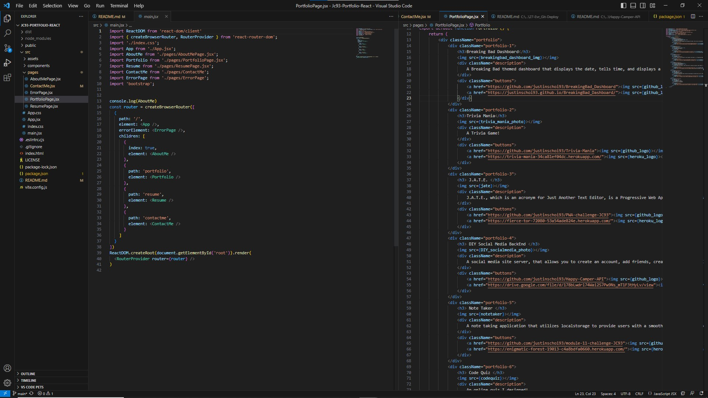

# My React Portfolio

## Technologies Used
| Javascript || (https://developer.mozilla.org/en-US/docs/Web/JavaScript) |
| Mongoose   || https://mongoosejs.com/                                   |
| React      || (https://react.dev//)                                     |
| React DOM  || (https://legacy.reactjs.org/docs/react-dom.html)          |
| Vite       || (https://vitejs.dev/)                                     |

## Description
My portfolio!

## Learning Experience
Working on this project was a great opportunity to practice using React, ReactDOM, Vite and Mongoose

## Credits 
* [LinkedIn](https://linkedin.com/in/justinchoica)
* [Github](https://github.com/justinschoi93)
* [Email](justinschoi93@gmail.com)
